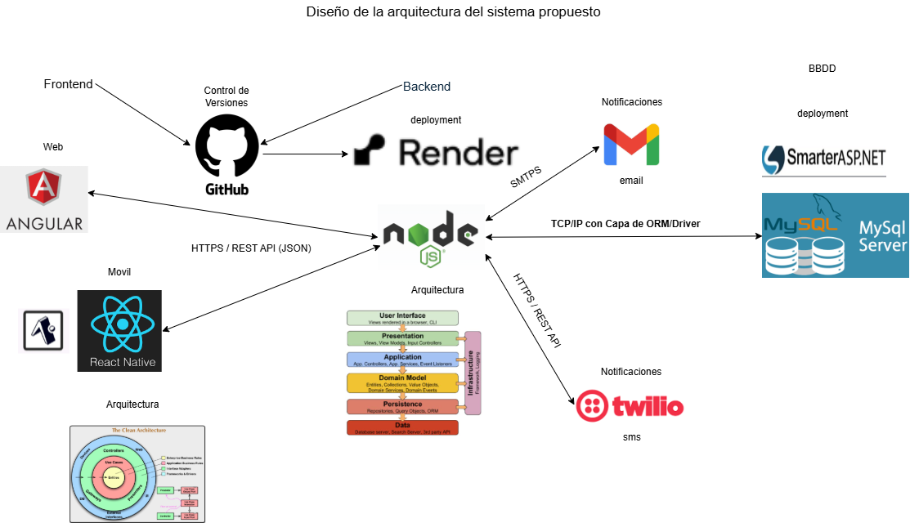
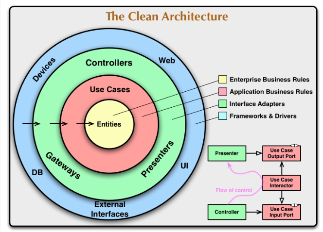

# Frontend Web  - Prueba Técnica Etikos 

Este repositorio contiene el cliente web (Frontend) del proyecto "Prueba Técnica -Etikos Jardín azuayo". Esta aplicación está desarrollada en **Angular 17** e implementa una **Arquitectura Limpia (Clean Architecture)** para garantizar la mantenibilidad y escalabilidad del código.

Esta aplicación consume una API REST desarrollada en Node.js, la cual gestiona la lógica de negocio, la autenticación de usuarios, y la comunicación con servicios de notificación como Gmail y Twilio y la base de datos.

## ✨ Características Principales

* **Autenticación Segura:** Implementación de inicio de sesión con correo y contraseña Las contraseñas se almacenan de forma segura usando Hashing con Bcrypt
* **Autenticación de Doble Factor (2FA):** Los usuarios pueden activar un segundo factor de autenticación. Al iniciar sesión, el sistema solicitará un código OTP enviado por correo electrónico y SMS
* **Recuperación de Contraseña:** Flujo seguro de recuperación de contraseña mediante la validación de un OTP enviado al usuario.
* **Gestión de Tokens (JWT):** Uso de JSON Web Tokens para asegurar las peticiones a rutas protegidas de la API.
* **Panel de Administración:** Funcionalidad para usuarios administradores que permite buscar, bloquear y desbloquear a otros usuarios del sistema.


## 🚀 Prerrequisitos


* **Node.js**: Se recomienda la versión v18.13.0 o superior (puedes verificar con `node -v`).
* **Angular CLI**: Debes tener instalada la versión 17 de Angular CLI de forma global.
    npm install -g @angular/cli@17

## ⚙️ Instalación y Puesta en Marcha


1.  **Clonar el repositorio**

    git clone y el link de este repositorio

2.  **Acceder al directorio del proyecto**
    cd EtikosJeffSvFromWEB


3.  **Instalar dependencias**
    npm install


4.  **Configurar el Entorno**
    Este proyecto necesita conectarse a la API de backend.  `src/app/environments/environment.ts` hay dos url podemos apuntar al back local o al back desplegado 
    en render.

    El prefijo de la API de preproducción desplegada en Render es: `https://etikosjeffsvback.onrender.com/`.

5.  **Ejecutar el Servidor de Desarrollo**
    Inicia el servidor de desarrollo local:
    ```bash
    ng serve
    ```
    Abre tu navegador y visita `http://localhost:4200/`. La aplicación se recargará automáticamente

## 🧪 Credenciales de Prueba (Administrador)

Para probar las funcionalidades de administración como bloquear/desbloquear usuarios, puedes utilizar las siguientes credenciales:

* **Email:** `pruebaEtikos1@outlook.com` 
* **Password:** `Etikos12025#` 

### 6. Arquitectura 

Arquitectura General del sistema 




Arquitectura Limpia en  el Frontend Web

